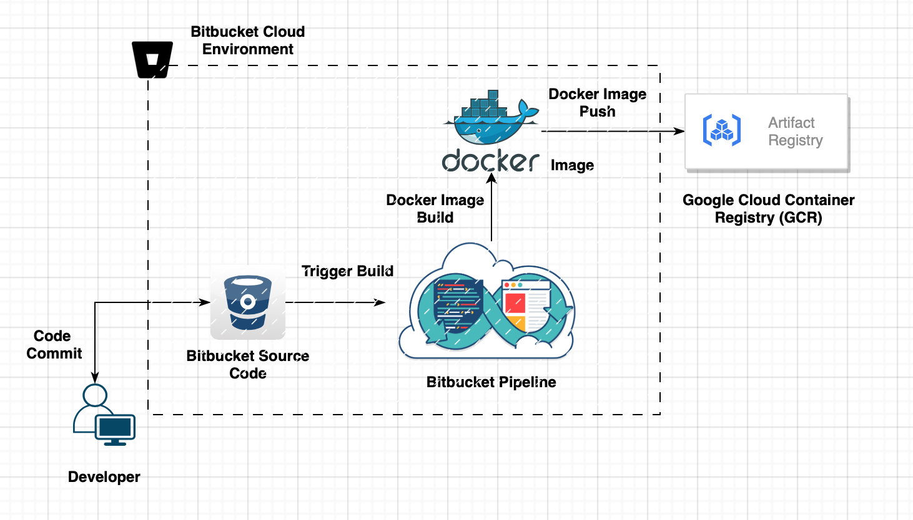
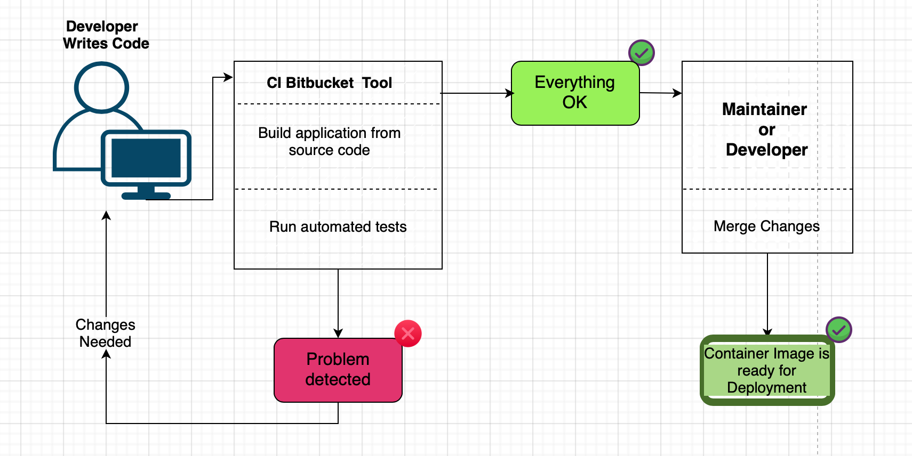

# Continous Integration Bitbucket Pipeline

Table of Contents
=================
* [Introduction](#introduction)
* [What is Continuous Integration (CI)?](#What is Continuous Integration (CI)?)
* [How can I experience a current developer flow?](#How can I experience a current developer flow?)
* [Continous Build Pipeline Architecture](Continous Build Pipeline Architecture)
* [Get started with Bitbucket Pipelines](Get started with Bitbucket Pipelines)
    * [Configure your first pipeline](Configure your first pipeline)
        * [Prerequisites](Prerequisites)
* [Development Pipeline Workflow](Development Pipeline Workflow)
* [Conclusion](Conclustion)
* [References](References)


## Introduction: <a name="introduction"></a>
This document explains about continous integration of a source code compile, test and build process using cloud Bitbucket pipeline.

## What is Continuous Integration (CI)? <a name="What is Continuous Integration (CI)?"></a>

Continuous Integration is a software development practice where members of a team integrate their work frequently, usually each person integrates
at least daily - leading to multiple commits per day. Each commit is verified by an automated build along with the test cases to detect application
workflow errors as quickly as possible. A project having a team of developers commits many times during a day. With each commit code is built and 
tested. If the test is passed, the build is tested for deployment. This commit, build, test and deploy is a continuous process that leads to significantly 
reduced bugs and allows a team to develop stable software more quickly. 

## How can I experience a current developer flow? <a name="How can I experience a current developer flow?"></a>
I assume myself as a developer part of the onboarding development team working on a small feature task. It doesn't matter the piece of software
feature working on can be done in few hours. We use Bitbucket source code control system keeps all of a project's source code in a repository. I begin
by taking a copy of the current source code (written in java) on to my local development environment, it could be a virtual machine or laptop 
from Bitbucket source code control system. The current state is usually referred to as the HEAD of any feature branch the latest code recides. I 
make a controlled copy of the HEAD onto their own machine, this is called "checking out". Here my machine code is referred as a "working copy". I
make my local machine working copy up to date (also called as tracked) whenever feature code is written by adding untracked files and commits. Once 
I am comfortable with the feature development, freeze the local code. Push it to origin (nothing but remote code copy Bitbucket).

`Local`  --> Local machine code copy tracked by Git

`Origin` --> Code is pushed, stored on Bitbucket for further collaboration

As soon as I push the code to the remote to Bitbucket the setting triggers a build automatically using the push webhook. Configured push webhook 
identifies each time push happens which intern starts to build the remote working code to my feature branch. It compiles and links it into an executable, 
and runs the automated tests. Only if it all builds and tests without errors is the overall build considered to be good. 

This is not final work, there could be a chance of failure during the build. Fix the issue locally and push it to the remote to trigger a new build.
Only when this build succeeds can I say my build is completed for the current feature development.

> ** _NOTE:_ ** The above scenario is explained to understand a developer build workflow and their usual development process. This would vary from team to 
team culture.

## Continous Build Pipeline Architecture <a name="Continous Build Pipeline Architecture"></a>



## Get started with Bitbucket Pipelines <a name="Get started with Bitbucket Pipelines"></a>
The current development code automatically compile, tests, and build are executed in cloud Bitbucket repository using a concept called "Bitbucket 
Pipeline". Bitbucket Pipelines is an integrated CI/CD service built into Bitbucket. This internally create container in the cloud. Having with all 
the advantages of a fresh system, customized and configured for your needs. A pipeline is defined using a YAML file called `bitbucket-pipelines.yml`,
which is located at the root of your repository.

### Configure your first pipeline <a name="Configure your first pipeline"></a>
There are two ways to configure your pipeline: you can either directly write the `YAML` file or you can use the UI wizard provided by Bitbucket. The 
steps below will guide you through the Pipelines configuration wizard. 

#### *The below pipeline is configured using the first option.*

#### Prerequisites: <a name="Prerequisites"></a>

* You need to have a Bitbucket Cloud account.

* Your workspace must have at least one repository.

``` yaml
definitions:
  services:
    postgres:
      image:
         name: us-central1-docker.pkg.dev/fdx-ri-dev/postgrsql/postgres:v1
         username: _json_key
         password: '$GCP_ARTIFAC_JSON_API'
      environment:
        POSTGRES_DB: postgres
        POSTGRES_USER: postgres
        POSTGRES_PASSWORD: $POSTGRES_PASSWORD
        DATABASE_URL: jdbc:postgresql://localhost:5432/postgres
  steps:
    - step: &build-push-image
        name: 'Build & Push Image'
        image: google/cloud-sdk:alpine
        services:
          - docker
        caches:
          - docker
        script:
          - export BITBUCKET_COMMIT_SHORT=$(echo $BITBUCKET_COMMIT | cut -c1-7)
          - docker build -t gcr.io/$FDX_GCP_PROJECT_NAME/tomcat:$BITBUCKET_COMMIT_SHORT --file ./config/tomcat/Dockerfile .
          - docker save --output tmp-image.docker gcr.io/$FDX_GCP_PROJECT_NAME/tomcat:$BITBUCKET_COMMIT_SHORT
          - docker load --input ./tmp-image.docker
          - echo $FDX_GCP_API_JSON > ./fdx-gcp-api-key.json
          - gcloud auth activate-service-account --key-file ./fdx-gcp-api-key.json
          - gcloud config set project $FDX_GCP_PROJECT_NAME
          - cat ./fdx-gcp-api-key.json | docker login -u _json_key --password-stdin https://gcr.io
          - docker push gcr.io/$FDX_GCP_PROJECT_NAME/tomcat:$BITBUCKET_COMMIT_SHORT
    - step: &build-fdx-ri-api
        name: 'Build FDX RI API'
        image: maven:3.8.6-openjdk-11-slim
        services:
          - postgres
        caches:
          - maven
        script:
          - mvn clean install -DreuseForks=false
        artifacts:
          - target/fdxapi##hosted-0.0.1-SNAPSHOT.war
          - target/fdxapi##dc-0.0.1-SNAPSHOT.war
    - step: &build-fdx-ri-tdm
        name: 'Build FDX RI TDM'
        image: maven:3.8.6-openjdk-11-slim
        services:
          - postgres
        caches:
          - maven
        script:
          - apt-get update && apt-get install -y unzip git curl python3
          - git clone --branch $BITBUCKET_BRANCH git@bitbucket.org:fdxdev/fdx-ri-tdm.git
          - cd  fdx-ri-tdm
          - mvn clean install -DskipTests
        artifacts:
          - fdx-ri-tdm/target/adminui##hosted-0.0.1-SNAPSHOT.war
          - fdx-ri-tdm/target/adminui##dc-0.0.1-SNAPSHOT.war
    - step: &build-fdx-ri-auth
        name: 'Build FDX RI AUTH'
        image: maven:3.8.6-openjdk-11-slim
        caches:
          - maven
        script:
          - apt-get update && apt-get install -y unzip git
          - git clone --branch $BITBUCKET_BRANCH git@bitbucket.org:fdxdev/fdx-ri-auth-server.git
          - cd  fdx-ri-auth-server
          - mvn clean install -DskipTests
        artifacts:
          - fdx-ri-auth-server/target/fdxriauthserver.war
    - step: &build-fdx-ri-client
        name: 'Build FDX RI CLIENT'
        image: maven:3.8.6-openjdk-11-slim
        caches:
          - maven
        script:
          - apt-get update && apt-get install -y unzip git
          - git clone --branch $BITBUCKET_BRANCH git@bitbucket.org:fdxdev/fdx-ri-auth-client.git
          - cd  fdx-ri-auth-client
          - mvn clean install -DskipTests
        artifacts:
          - fdx-ri-auth-client/target/fdxriauthclient.war

#The below steps defines the actual build flow goes in ascending order. First, pipeline executes "build-fdx-ri-api" job then the "build-fdx-ri-auth" job then "build-fdx-ri-client" and finally "build-fdx-ri-tdm" will be executed The whole flow completes the build pipeline. Note: we have defined three different deployment such as test (Development), staging (Staging) and production (Production) pointing to respective GCP container registry to push images after success compile and build the Docekr images. Pipeline will trigger based on the below "branches" configuration. Ex: develop branches config is poiting to the development environment and so on.

pipelines:

#branches section defines the actual branch where the pipeline monitors for a state change.
  branches:
      develop: #This step is configured "develop" as a remote branch.

#Pipeline flow is configured as, trigger happens like this --> 1. build-fdx-ri-api --> 2. build-fdx-ri-auth --> 3.build-fdx-ri-client --> 4. build-fdx-ri-tdm - Pipeline COMPLETED
       - step: *build-fdx-ri-api
       - step: *build-fdx-ri-auth
       - step: *build-fdx-ri-client
       - stage:
           name: My Dev Deployment

#deployment - "test" is referred as a development environment is configured in such that the trigger suppose to happens manually.
           deployment: test
           steps:
             - step:
                 <<: *build-fdx-ri-tdm
             - step:
                 <<: *build-push-deploy-image-custom-tomcat

#deployment - "staging" is referred as a Staging environment
      staging:
       - step: *build-fdx-ri-api
       - step: *build-fdx-ri-tdm
       - step: *build-fdx-ri-auth
       - step: *build-fdx-ri-client
       - step:
           <<: *build-push-image
           deployment: staging
           trigger: manual

#deployment - "production" is referred as a Production environment
      production:
       - step: *build-fdx-ri-api
       - step: *build-fdx-ri-tdm
       - step: *build-fdx-ri-auth
       - step: *build-fdx-ri-client
       - step:
           <<: *build-push-image
           deployment: production
           trigger: manual
```
## Development Pipeline Workflow <a name="Development Pipeline Workflow"></a>

The Continuous Integration requires an automated pipeline workflow whenever some new code is pushed to the repository, the pipeline is triggered
and starts to unit test the code, build the image and push the image to a container registry. The workflow explaination of a continous integration 
is described in the below workflow diagram.



Once developer clicks the Commit file button, BitBucket will immediately kick off the first run. If everything runs smoothly, user should see green
check marks next to all steps in the Pipeline job panel. Got to GCP container registry to validate images are pushed successfully.

## Conclusion <a name="Conclusion"></a>
Congratulations! Whenever there is a new code commit push to the BitBucket repository, the Pipeline will unit test the code, build a new image and
push it to GCP container registry. So BitBucket just takes over the repetitive stuffs and frees you from the manual efforts. These automated build 
pipeline enncouraged to write and commit more quality code.

## References <a name="References"></a>
* https://support.atlassian.com/bitbucket-cloud/docs/get-started-with-bitbucket-pipelines/
* https://cloud.google.com/container-registry
